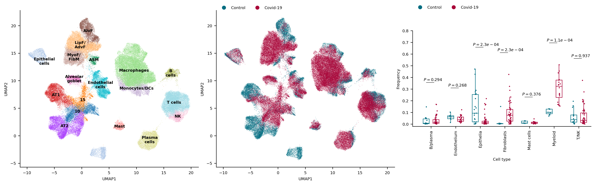

## **Single-cell RNA Sequencing analysis project**

This is a personal challenge I undertook to learn single-cell RNA sequencing (scRNAseq) analysis.

1. For this purpose, I decided to reconstruct a Nature paper (https://www.nature.com/articles/s41586-021-03569-1).
The authors in this study investigated lung cells from multiple COVID-19 patients who succumbed to the disease, to construct a comprehensive cellular atlas.

2. As a native Python programmer, I chose to utilize the Scanpy package for the task.
While Scanpy may be relatively new and less widespread compared to its R counterpart, Seurat, its community is rapidly expanding.
Moreover, Scanpy seamlessly integrates with various Python's multiomics packages, such as Squidpy for spatial transcriptomics.
But frankly, the most significant advantage of Scanpy is just that it's in Python =)!

3. I took advantage of this work to raise my visualization skills by making sure to create plots designed similarly as possible to the plots in the article.

4. All the code can be examined in the jupyter notebook (single_cell_analysis.md or single_cell_analysis.ipynb) present. The reconstructed figures are also given as png files.

This project is an ongoing endeavor, and I welcome any questions, tips, critiques, or suggestions that could help me enhance my skills.

**Yatir.**

June 8, 2023

